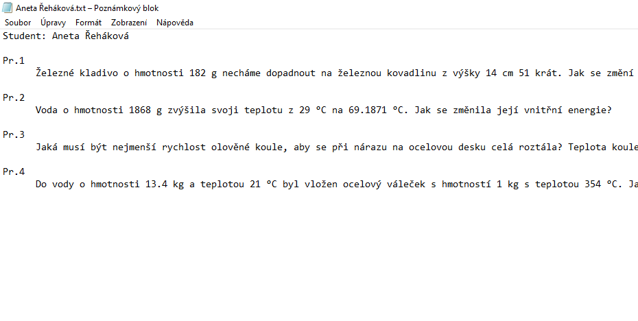
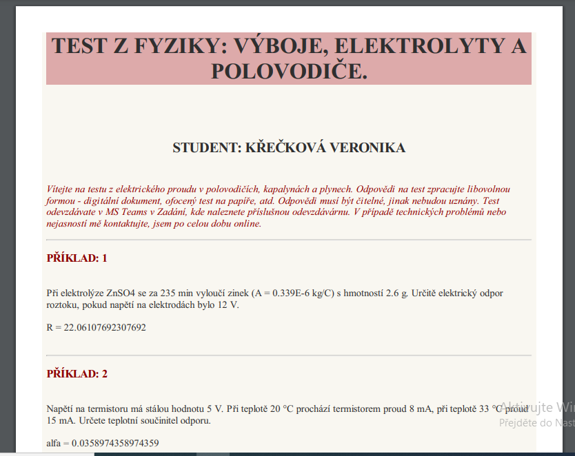

# Pyxercise

Python exercise generator

## 1. Popis projektu

Projekt Pyxercise ma za úkol vytvořit webovou aplikaci schopnou generovat unikátní příklady pro žáky základních a středních škol. Program vznikl během dvou nocí při online výuce v době pandemie. Aplikace dokáže ze souborů v XML formátu generovat PDF soubory se zadáním, které je v určitých místech nahrazeno dynamicky generovaným obsahem. Uživateli se vygenerují dvě verze PDF souboru - bez řešení a s řešením. Aplikaci lze použít pro procvičování příkladů a pro generování písemek s rychlou opravou učitelem.

První noc vznikla aplikace v zadáním testu v obyčejné textové podobě.

Druhou noc byl dodán design zadání s využitím kaskádových stylů a html kódu.

## 2. Instalace aplikace

## 3. Návod k použití

## 4. Rozbor kódové báze

## 5. Poděkování

Zatím nikomu :)

